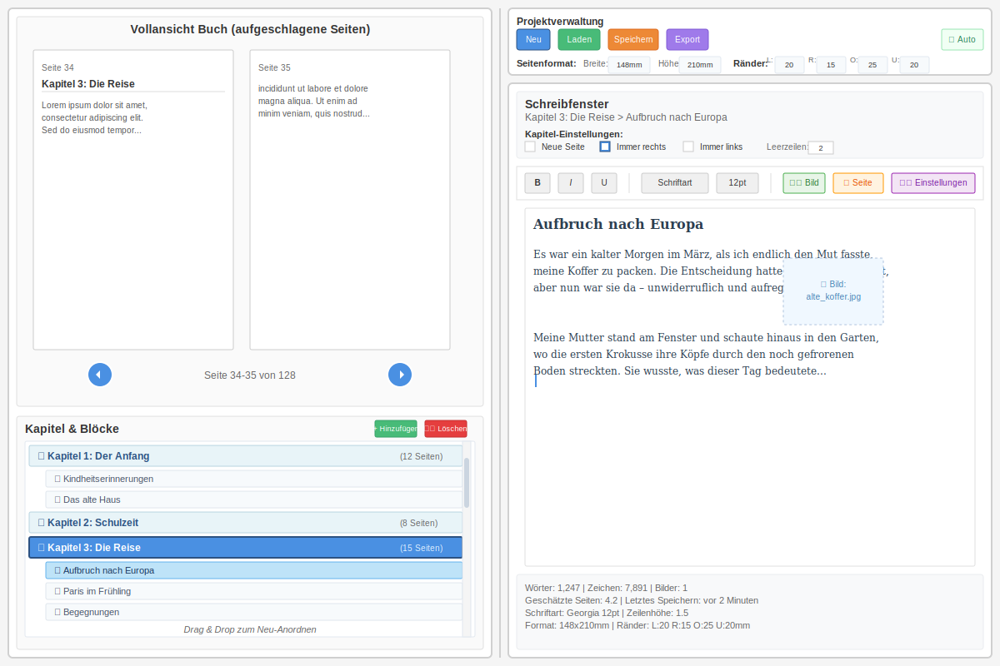

# Memoir Editor

A professional WPF application for creating and editing memoirs with live PDF preview, hierarchical chapter organization, and precise layout control.



## Features

- **Live Book Preview**: Real-time PDF preview using QuestPDF and WebView2
- **WYSIWYG Editor**: Rich text editing with RichTextBox
- **Hierarchical Organization**: Chapters and blocks with drag & drop support
- **Precise Layout Control**: Customizable page format and margins (mm precision)
- **PDF Export**: Export to PDF with exact layout matching the preview
- **Auto-Save**: Automatic project saving with configurable intervals
- **Chapter Settings**: Control page breaks, positioning (left/right), and spacing

## Technology Stack

- **.NET 9.0** - Latest framework with modern C# 12 features
- **WPF** - Windows Presentation Foundation for rich desktop UI
- **QuestPDF** - PDF generation and rendering engine
- **WebView2** - Chromium-based PDF preview
- **CommunityToolkit.Mvvm** - Source generators for MVVM pattern
- **Microsoft.Extensions.Hosting** - Dependency injection and service lifetime management
- **Newtonsoft.Json** - Project serialization to .memoir files

## Architecture

### MVVM + Dependency Injection

The application uses a clean MVVM architecture with full dependency injection:

```
MemoirEditor/
├── Models/              # Data models (MemoirProject, Chapter, Block)
├── ViewModels/          # MVVM ViewModels with ObservableProperty
├── Views/               # XAML views (MainWindow)
├── Services/            # Business logic implementations
├── Interfaces/          # Service contracts
├── Helpers/             # Utility classes
└── Converters/          # XAML value converters
```

### Key Services

- **IQuestPdfRenderer**: PDF generation using QuestPDF
- **IWebViewService**: WebView2 management for preview
- **IRenderQueue**: Background rendering with debouncing
- **IProjectRepository**: Load/save .memoir files (JSON)
- **IAutoSaveService**: Automatic saving with configurable intervals
- **IImageService**: Image import and processing
- **IExportService**: PDF export with progress reporting

## Getting Started

### Prerequisites

- .NET 9.0 SDK or later
- Windows 10/11
- WebView2 Runtime (Edge Chromium)

### Building

```bash
cd src/MemoirEditor
dotnet restore
dotnet build
```

### Running

```bash
dotnet run
```

## Project Structure

```
├── src/
│   └── MemoirEditor/        # Main WPF application
│       ├── Models/
│       ├── ViewModels/
│       ├── Views/
│       ├── Services/
│       ├── Interfaces/
│       ├── Helpers/
│       └── Converters/
├── docs/                    # Documentation
├── tests/                   # Unit and integration tests (planned)
├── assets/                  # Images, icons, resources
└── memoir_editor_specification.md  # Complete UI/UX specification
```

## File Format

Projects are saved as `.memoir` files in JSON format:

```json
{
  "Id": "...",
  "Metadata": {
    "Title": "Mein Memoir",
    "Author": "...",
    "PageFormat": { "Width": 148, "Height": 210 },
    "Margins": { "Left": 20, "Right": 15, "Top": 25, "Bottom": 20 }
  },
  "Chapters": [...],
  "GlobalSettings": {
    "Font": "Georgia",
    "FontSize": 12,
    "LineHeight": 1.5,
    "AutoSave": true
  }
}
```

## Development Roadmap

### Current Status (MVP)
- ✅ Project architecture (DI, MVVM, services)
- ✅ Core data models
- ✅ Basic UI layout (responsive)
- ✅ QuestPDF integration
- ✅ Service implementations (stubs)

### Next Steps
- [ ] WebView2 integration for live preview
- [ ] Rich text editor bindings
- [ ] Chapter/Block drag & drop
- [ ] File dialog integration (Open/Save)
- [ ] Image import functionality
- [ ] Complete rendering pipeline
- [ ] Auto-save implementation
- [ ] Keyboard shortcuts
- [ ] Undo/Redo support
- [ ] Search and replace
- [ ] Spell checking
- [ ] Export templates

## Documentation

- [Architecture Documentation](docs/ARCHITECTURE.md) - Detailed architecture overview
- [Development Guide](docs/DEVELOPMENT.md) - Setup and development workflow
- [UI Specification](memoir_editor_specification.md) - Complete UI/UX specification

## Contributing

This is a personal project. Contributions are welcome via pull requests.

## License

[Specify your license here]

## Credits

- **QuestPDF** - PDF generation library
- **CommunityToolkit.Mvvm** - MVVM helpers and source generators
- **Microsoft.Web.WebView2** - Chromium-based web view

## Support

For questions, issues, or feature requests, please open an issue on GitHub.